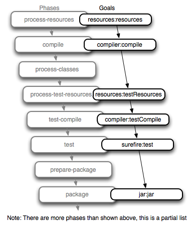

!SLIDE
# Maven

!SLIDE bullets
# Maven defines:
* Project Object Model
* Dependency Management
* Plugins
* Project Lifecycle

!SLIDE
# Project Object Model

!SLIDE small
# located at `pom.xml`
    @@@XML
    <project xmlns="http://maven.apache.org/POM/4.0.0" 
     xmlns:xsi="http://www.w3.org/2001/XMLSchema-instance"
     xsi:schemaLocation="http://maven.apache.org/POM/4.0.0 
                http://maven.apache.org/maven-v4_0_0.xsd">
      <modelVersion>4.0.0</modelVersion>
      <groupId>com.zenslade</groupId>
      <artifactId>example</artifactId>
      <version>0.1</version>
    </project>

!SLIDE
# Dependency Management

!SLIDE
# Adding dependency
    @@@XML
    <dependencies>
      <dependency>
        <groupId>org.clojure</groupId>
        <artifactId>clojure</artifactId>
        <version>1.2.0-master-SNAPSHOT</version>
      </dependency>
    </dependencies>

!SLIDE
# Dependencies can be scoped
    @@@XML
    <dependency>
      <groupId>swank-clojure</groupId>
      <artifactId>swank-clojure</artifactId>
      <version>1.2.1</version>
      <scope>test</scope>
    </dependency>

!SLIDE
# Dependencies are kept in ~/.m2/

!SLIDE bullets
* compile
* runtime
* provided
* test

!SLIDE small
# Adding repositories
    @@@XML
    <repositories>
      <repository>
        <id>clojure</id>
        <url>http://build.clojure.org/releases</url>
      </repository>
      <repository>
        <id>clojars.org</id>
        <url>http://clojars.org/repo</url>
      </repository>
    </repositories>

!SLIDE 
# Plugins

!SLIDE bullets
* compiler
* surefire (run java tests)
* jar/war
* clean

!SLIDE bullets
# Plugins define goals

* compiler:compile
* compiler:testCompile

!SLIDE command
# mvn compiler:compile

!SLIDE center
# Project Lifecycle

!SLIDE command
# mvn package
